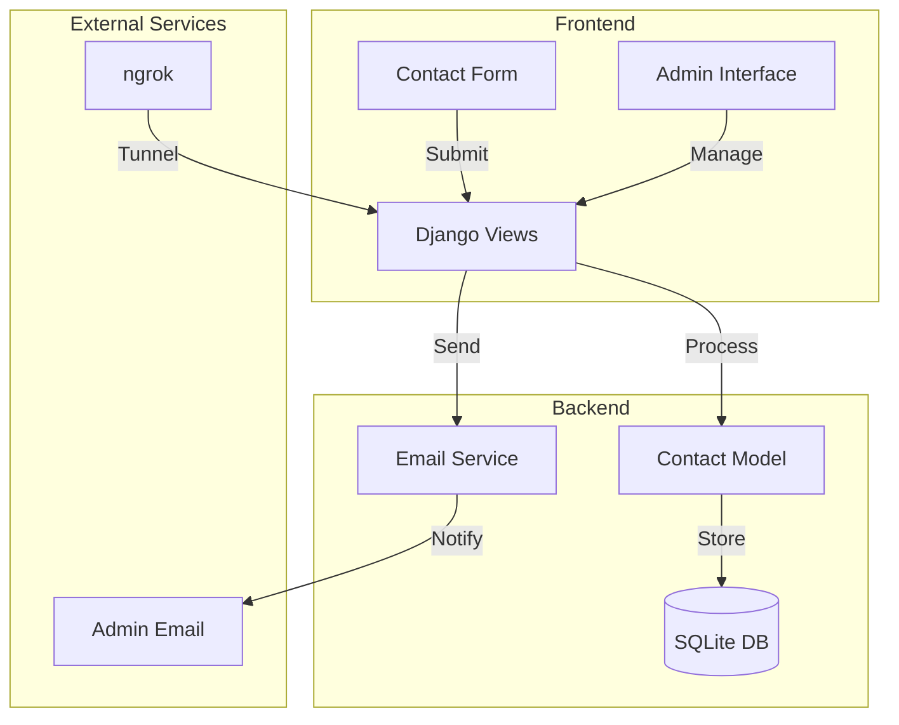
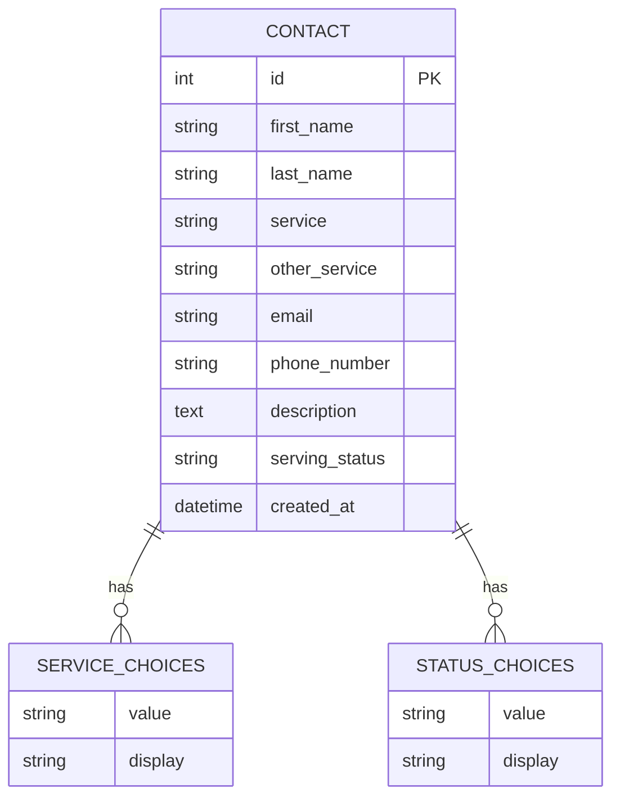
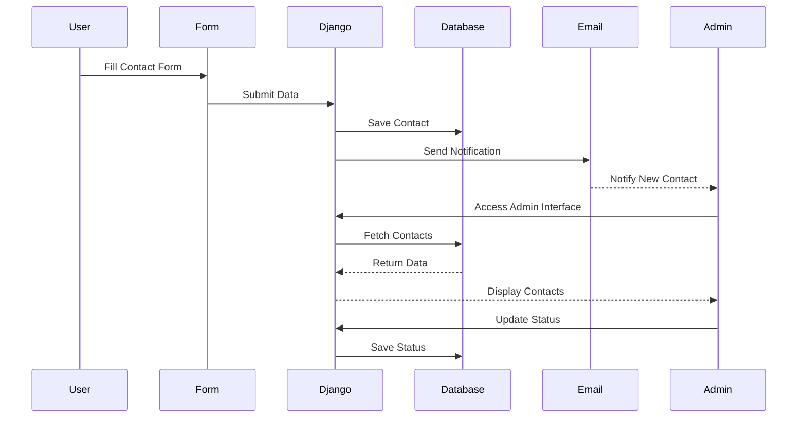
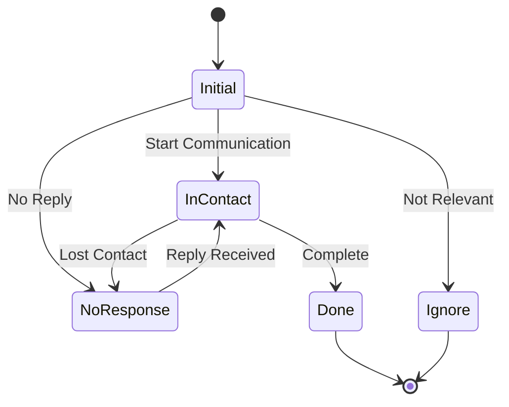

# Contact Management System

A modern contact management system built with Django and React, featuring a beautiful UI with dark mode.

## Features

- Modern React frontend with responsive design
- Dark mode support with orange/black theme
- Contact form for submitting new inquiries
- Admin dashboard to view and manage contacts
- Status tracking for each contact (Initial, In Contact, Done, etc.)
- Email notifications for new submissions

## Tech Stack

### Backend
- Django
- Django REST Framework
- SQLite database (can be configured for other databases)

### Frontend
- React
- React Router for navigation
- Tailwind CSS for styling
- Heroicons for beautiful icons
- Dark mode support

## Setup and Installation

### Prerequisites
- Python 3.6+
- Node.js and npm
- Git

### Installation

1. Clone the repository:
```
git clone <repository-url>
cd contact-management-system
```

2. Set up the Python virtual environment:
```
python -m venv venv
source venv/bin/activate  # On Windows, use: venv\Scripts\activate
pip install -r requirements.txt
```

3. Set up environment variables:
Create a `.env` file in the project root with the following variables:
```
MAIL_USERNAME=your-email@gmail.com
MAIL_PASSWORD=your-email-password
MAIL_DEFAULT_SENDER=your-email@gmail.com
ADMIN_EMAIL=admin-email@example.com
```

4. Install frontend dependencies:
```
cd frontend
npm install
```

5. Build the frontend:
```
npm run build
cd ..
```

6. Run database migrations:
```
python manage.py migrate
```

7. Create a superuser:
```
python manage.py createsuperuser
```

## Running the Application

### Development Mode

1. Run the Django backend:
```
make run-backend
```

2. In a new terminal, run the React frontend:
```
make run-frontend
```

Access the app at http://localhost:3000

### Production Mode

1. Build the frontend:
```
make build-frontend
```

2. Collect static files:
```
make collect-static
```

3. Run the Django server:
```
python manage.py runserver
```

Access the app at http://localhost:8000

## Admin Access

The admin panel is available at http://localhost:8000/admin. Use the superuser credentials you created earlier to log in.

## License

This project is licensed under the MIT License.

## System Architecture



## Database Schema



## Component Interaction



## Status Flow



## API Endpoints

```mermaid
graph LR
    subgraph "Public Endpoints"
        A[/contact/] -->|POST| B[Create Contact]
        A -->|GET| C[Contact Form]
    end
    
    subgraph "Admin Endpoints"
        D[/] -->|GET| E[Contact List]
        F[/update_status/:id/] -->|POST| G[Update Status]
        H[/admin/] -->|GET/POST| I[Django Admin]
    end

    style A fill:#f9f,stroke:#333
    style D fill:#bbf,stroke:#333
    style F fill:#dfd,stroke:#333
    style H fill:#fdd,stroke:#333
```

## Features

### Contact Form
- Modern, responsive design with Tailwind CSS
- Pre-defined service categories with custom "Other" option
- Dynamic form fields with real-time interactions
- Client-side validation
- Professional form layout and styling

### Service Categories
- Web Development
- Mobile App Development
- UI/UX Design
- IT Consulting
- Maintenance & Support
- Other (with custom specification)

### Contact Management
- Status tracking system with color coding:
  - Initial (Gray)
  - In Contact (Blue)
  - Done (Green)
  - No Response (Red)
  - Ignore (Yellow)
- Email notifications for new submissions
- Admin interface for managing contacts
- Sortable and filterable contact list

## Technology Stack

- Python 3.x
- Django 5.2
- Tailwind CSS
- SQLite (default database)
- SMTP Email Integration
- ngrok for public access

## Setup Instructions

1. Clone the repository:
```bash
git clone <repository-url>
cd <project-directory>
```

2. Install system dependencies:
```bash
sudo apt-get install python3-django-cors-headers ngrok
```

3. Install Python dependencies:
```bash
pip install -r requirements.txt
```

4. Create a `.env` file in the project root with the following variables:
```
SECRET_KEY=your-secret-key-here
MAIL_USERNAME=your-email@gmail.com
MAIL_PASSWORD=your-app-specific-password
MAIL_DEFAULT_SENDER=your-email@gmail.com
ADMIN_EMAIL=your-admin-email@gmail.com
NGROK_AUTH_TOKEN=your-ngrok-auth-token
```

5. Run migrations:
```bash
python manage.py migrate
```

6. Create a superuser (for admin access):
```bash
python manage.py createsuperuser
```

## Running the Application

### Local Development
```bash
python manage.py runserver
```
Access at: `http://localhost:8000`

### Public Access with ngrok

1. Sign up for a free ngrok account at https://dashboard.ngrok.com/signup

2. Get your authtoken from https://dashboard.ngrok.com/get-started/your-authtoken

3. Add your authtoken to `.env` file as `NGROK_AUTH_TOKEN`

4. Start the Django server:
```bash
python manage.py runserver
```

5. In a new terminal, start ngrok:
```bash
ngrok http 8000
```

The ngrok output will show you two URLs (http and https) that you can share with others to access your application.

### ngrok Features and Limitations (Free Plan)
- Randomly generated URLs (change each session)
- 40 connections per minute
- 1 concurrent tunnel
- HTTPS support
- Basic request inspection

## Security Configuration

### CSRF Protection
The application is configured to handle CSRF protection with ngrok domains. The following settings are automatically configured:

```python
CSRF_TRUSTED_ORIGINS = [
    'http://localhost:8000',
    'http://127.0.0.1:8000',
    'https://*.ngrok-free.app',
    'http://*.ngrok-free.app',
]
```

### CORS Configuration
Cross-Origin Resource Sharing (CORS) is configured to work with ngrok:

```python
CORS_ALLOW_ALL_ORIGINS = True
CORS_ALLOW_CREDENTIALS = True
```

## Usage

### For Customers
1. Access the contact form at: `[your-ngrok-url]/contact/`
2. Fill in the required information:
   - Name (First and Last)
   - Select a service category (or specify custom)
   - Email address
   - Phone number (optional)
   - Detailed description
3. Submit the form and receive confirmation

### For Administrators
1. Access the admin interface at: `[your-ngrok-url]/admin/`
2. View all contacts at: `[your-ngrok-url]/`
3. Manage contacts:
   - Update status using the dropdown menu
   - View contact details
   - Filter and sort contacts
4. Receive email notifications for new submissions

## Troubleshooting

### CSRF Issues
If you encounter CSRF verification failures:
1. Clear browser cookies and cache
2. Use the https:// ngrok URL
3. Verify CSRF token in form
4. Check that your domain is in CSRF_TRUSTED_ORIGINS

### Email Issues
1. Verify Gmail 2FA is enabled
2. Confirm App Password is correct
3. Check spam folder for notifications

## Integration with Other Django Projects

To integrate this contact system into an existing Django project:

1. Copy the `contacts` app directory to your project
2. Add required settings to settings.py:
```python
INSTALLED_APPS = [
    ...
    'contacts',
    'corsheaders',
]

MIDDLEWARE = [
    ...
    'corsheaders.middleware.CorsMiddleware',
    ...
]

# CSRF and CORS settings
CSRF_TRUSTED_ORIGINS = [...]
CORS_ALLOW_ALL_ORIGINS = True
CORS_ALLOW_CREDENTIALS = True
```

3. Add URL patterns in your main urls.py:
```python
path('contacts/', include('contacts.urls')),
```

4. Configure email settings in settings.py
5. Run migrations:
```bash
python manage.py migrate
```

## Contributing

Contributions are welcome! Please feel free to submit a Pull Request.

## Security Notes

1. In production:
   - Set DEBUG = False
   - Use secure HTTPS connections
   - Implement rate limiting
   - Review CORS and CSRF settings
   - Protect sensitive data

2. ngrok security:
   - URLs are public and accessible to anyone
   - Consider using ngrok's paid features for additional security
   - Monitor access logs for suspicious activity 

## Database Management

### Local Database Setup
The application uses SQLite as its database. To manage the database across different devices:

1. **Initial Setup on a New Device**:
   ```bash
   python manage.py migrate
   ```

2. **Backing Up the Database**:
   ```bash
   python manage_db.py backup
   ```
   This creates a timestamped backup in the `database_backups` directory.

3. **Restoring from Backup**:
   ```bash
   python manage_db.py restore database_backups/db_backup_YYYYMMDD_HHMMSS.sqlite3
   ```

4. **Running Migrations**:
   ```bash
   python manage_db.py migrate
   ```

### Database Portability
- The database file (`db.sqlite3`) is excluded from version control
- Use the backup/restore functionality to transfer data between devices
- Always run migrations after restoring a database backup
- Keep backups in a shared location (like cloud storage) for easy access 
